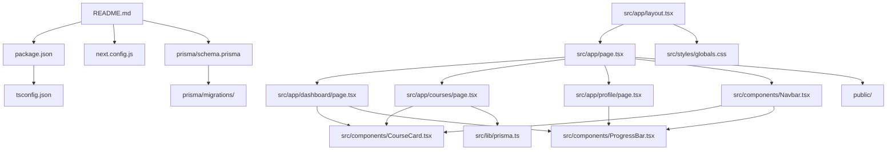

# ppc-training-app - Code Dependency Graph

```mermaid
graph TD
    N0["README.md"]
    N1["package.json"]
    N2["next.config.js"]
    N3["tsconfig.json"]
    N4["prisma/schema.prisma"]
    N5["prisma/migrations/"]
    N6["src/app/layout.tsx"]
    N7["src/app/page.tsx"]
    N8["src/app/dashboard/page.tsx"]
    N9["src/app/courses/page.tsx"]
    N10["src/app/profile/page.tsx"]
    N11["src/components/Navbar.tsx"]
    N12["src/components/CourseCard.tsx"]
    N13["src/components/ProgressBar.tsx"]
    N14["src/lib/prisma.ts"]
    N15["src/styles/globals.css"]
    N16["public/"]
    N0 --> N1
    N0 --> N2
    N0 --> N4
    N1 --> N3
    N4 --> N5
    N6 --> N7
    N7 --> N8
    N7 --> N9
    N7 --> N10
    N7 --> N11
    N8 --> N12
    N8 --> N13
    N9 --> N12
    N10 --> N13
    N11 --> N12
    N11 --> N13
    N9 --> N14
    N6 --> N15
    N7 --> N16
```